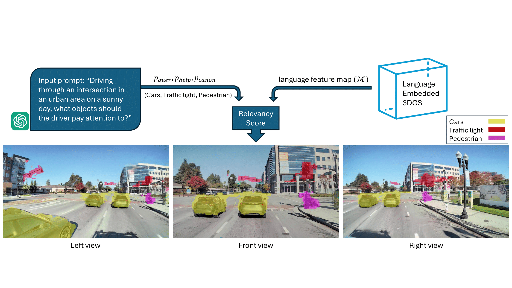

<div align="center">

<h1><b>Query3D</b>: LLM-Powered Open-Vocabulary Scene Segmentation with Language Embedded 3D Gaussians</h1>

<div>
    <a href='https://scholar.google.com/citations?user=MeK_1LUAAAAJ&hl=en' target='_blank'>Amirhosein Chahe<sup>1</sup></a>&emsp;
    <a href='https://scholar.google.com/citations?user=0sNe1G4AAAAJ&hl=en' target='_blank'>Lifeng Zhou<sup>1</sup></a>&emsp;
</div>
<div>
    <sup>1</sup>Drexel University, Philadelphia PA 19104, USA&emsp;
</div>
<div>
    <a href='https://arxiv.org/abs/2408.03516'>Paper)</a> | <b>Accepted at the LLVM-AD Workshop at WACV 2025</b>
</div>

<div>
<a target="_blank" href="https://arxiv.org/abs/2408.03516">
  
</a>
<a target="_blank" href="https://wacv2025.thecvf.com/">
  
</a>
</div>

<h4>TL;DR</h4>
<h5>We present Query3D, a novel method for open-vocabulary 3D scene querying in autonomous driving by combining Language Embedded 3D Gaussians with Large Language Models (LLMs).</h5>

<br>

<tr>
    
</tr>

</div>

***Abstract**: This paper introduces a novel method for open-vocabulary 3D scene querying in autonomous driving by combining Language Embedded 3D Gaussians with Large Language Models (LLMs). We propose utilizing LLMs to generate both contextually canonical phrases and helping positive words for enhanced segmentation and scene interpretation. Our method leverages GPT-3.5 Turbo as an expert model to create a high-quality text dataset, which we then use to fine-tune smaller, more efficient LLMs for on-device deployment. Our comprehensive evaluation on the WayveScenes101 dataset demonstrates that LLM-guided segmentation significantly outperforms traditional approaches based on predefined canonical phrases. Notably, our fine-tuned smaller models achieve performance comparable to larger expert models while maintaining faster inference times. Through ablation studies, we discover that the effectiveness of helping positive words correlates with model scale, with larger models better equipped to leverage additional semantic information. This work represents a significant advancement towards more efficient, context-aware autonomous driving systems, effectively bridging 3D scene representation with high-level semantic querying while maintaining practical deployment considerations.*


## Overview
This repository contains code for LLM-powered semantic querying of 3D Gaussian Splatting scenes. Built upon the [LEGaussian](https://github.com/buaavrcg/LEGaussians) framework, this project extends the capabilities by integrating Large Language Models (LLMs) like Qwen and Llama for semantic scene understanding and manipulation.

Our project enables semantic querying and manipulation of 3D Gaussian Splatting scenes using natural language through LLM integration. Users can query scene elements, modify representations, and generate targeted visualizations through natural language interactions.

## Datasets

### WayveScenes Dataset
The main dataset used in this project is WayveScenes 101, which can be downloaded from the [official repository](https://github.com/wayveai/wayve_scenes).

### Pre-processed Data
For convenience, we provide pre-processed data used in our paper:
- Subset of scenes used in experiments
- Pre-extracted language features
- Pre-computed codebooks

Download link: [Google Drive Link]

After downloading, place the data in the following structure:
```
data/
├── wayvescene/
│   ├── scene_xxx/
│   │   ├── images/
│   │   ├── sparse/
│   │   ├── xxx_encoding_indices.pt
│   │   └── xxx_codebook.pt

```

Note: Please cite the original [WayveScenes paper](https://github.com/wayveai/wayve_scenes) if you use their dataset in your research.

## Installation

This project uses two Docker environments: one for the main Gaussian Splatting framework and another for LLM finetuning.

### Main Environment Setup

1. Clone the repository:
```bash
git clone https://github.com/AmirhoseinCh/Query-3DGS-LLM.git
cd Query-3DGS-LLM
```

2. Build the main Docker image:
```bash
docker build -t legaussians .
```

3. Run the container:
```bash
./run.sh
```

The `run.sh` script will set up the Docker environment and start the container with all necessary dependencies installed.

### LLM Finetuning Environment

For LLM finetuning, we use [unsloth](https://github.com/unslothai/unsloth), which requires a separate environment:

1. Navigate to the unsloth directory:
```bash
cd unsloth
```

2. Build the unsloth Docker image:
```bash
docker build -t unsloth .
```

3. Run the unsloth container:
```bash
./run_unsloth.sh
```

This will set up the environment specifically for finetuning LLMs (Qwen and Llama models).

Note: Make sure you have Docker installed on your system before proceeding with either installation.

## Pipeline

### 1. Preprocessing

We extract and process features from multi-view images following these steps:

1. Extract dense CLIP and DINO features from multi-view images
2. Concatenate them as dense features
3. Quantize the features and save:
   - Feature indices (`xxx_encoding_indices.pt`)
   - Codebook (`xxx_codebook.pt`)

To preprocess the images:
```bash
cd preprocess
python quantize_features.py --config configs/wayvescene/xxx.cfg
```

Configuration files for specific scenes can be found in `./preprocess/configs/wayvescene`. You can modify these configs for other scenes or datasets.

### 2. Training

Train the model using the `train.py` script. Config files specify:
- Data and output paths
- Training hyperparameters
- Test set
- Language feature indices path

```bash
python train.py --config configs/wayvescene/xxx.cfg
```

Training configs for the WayveScenes 101 dataset are located in `./configs/wayvescene`.

### 3. Rendering

You can render scenes using the batch rendering script for multiple scenes:
```bash
./render_scenes.sh
```

The rendering process generates:
- RGB images
- Relevancy maps of text queries
- Segmentation masks

### 4. Evaluation

Run evaluation on the rendered results using:
```bash
./eval_scenes.sh
```

This script will evaluate the model's performance across all specified scenes and generate metrics including:
- Mean accuracy
- Mean IoU
- Mean precision

## Models and Finetuning

We support multiple LLM models:
- Qwen 2.5 series (0.5B, 1.5B, 3B, 7B)
- Llama series (1B, 3B, 8B)

### Model Finetuning

The project uses [unsloth](https://github.com/unslothai/unsloth) for efficient LLM finetuning:

1. Start the unsloth Docker container:
```bash
cd unsloth
./run_unsloth.sh
```

2. Run the finetuning process using the provided Jupyter notebook:
```
finetune.ipynb
```

The notebook contains all necessary steps and instructions for finetuning both Qwen and Llama models.

Finetuned models will be saved in the respective output directories based on the model size and type (e.g., `outputs-3B/` for Qwen 2.5 3B model).


## Contributing

We welcome contributions! Please feel free to submit a Pull Request.

## Citation

If you use this code in your research, please cite our work:

```bibtex
@misc{chahe2024query3dllmpoweredopenvocabularyscene,
      title={Query3D: LLM-Powered Open-Vocabulary Scene Segmentation with Language Embedded 3D Gaussian}, 
      author={Amirhosein Chahe and Lifeng Zhou},
      year={2024},
      eprint={2408.03516},
      archivePrefix={arXiv},
      primaryClass={cs.CV},
      url={https://arxiv.org/abs/2408.03516}, 
}
```

## Acknowledgments

This work builds upon the [LEGaussian](https://github.com/buaavrcg/LEGaussians) implementation. We thank the original authors for making their code available.

## License

[LICENSE] - See LICENSE file for details


